# Week 18 Homework Assignment: Introduction to Blockchain
Sydney Uni - Fintech Bootcamp 

Week 18 homework assignment - due 10 August 2021

by Grace Ho
&nbsp;

## Set up of Private Testnet for ZBank developer team.

&nbsp;

## Assignment Notes:
For the purpose of the assignment submission, the following information has also been submitted via GitHub:
 - This README file and the associated screenshots, as the instructional document for the ZBank Developer Team.
 - A 'Screenshots' folder containing: (a) puppeth configuration, and (b) the testnet Ether transfer 'transaction metadata'.
 - The Code files which includes: (a) the assignmtnet.json file, (b) the two created node folders (node 20 and node 21).

&nbsp;
## 1.0 Background:
To provide a private environment for testing by the developer team, a private Proof of Authority ethereum testnet has been created called 'assignmtnet', as well as two test nodes (one mining, and one bootnode).  Developers can re-create this testnet and nodes for testing on the private blockchain, including establishing mining nodes.  Alternatively, the keys have been provided so developers can access the node accounts for testing purposes.

This documentation outlines the steps required to create & access the private testnet and node accounts.

&nbsp;
## 2.0 Preliminary set up requirements
Two installations are required:
1. **Go Ethereum**

    The most recent version of "Geth & Tools" should be installed from the Go Ethereum website at https://geth.ethereum.org/downloads/. 

    Once the tools archive has been installed, locate in your 'Downloads' folder a file called 'geth-alltools-darwin-amd64-1.9.7-a718daa6.tar.gz' (or similar, depending on downloaded version). 
    Decompress this file in your preferred computer hard drive location, so that can be accessed from the terminal window later.  
    
    Then renamed the folder to **'Blockchain-Tools'** for easy recognition later.

2. **MyCrypto Wallet**

    Download from https://download.mycrypto.com/.  (Alternatively MetaMask may also be used.)
&nbsp;

Environment Requirements:
 - The Terminal will also be utilised to establish the testnet and access or initialise the nodes. We will utilise the **Puppeth** package.

&nbsp;
## 3.0 General Information
The below are the pre-configured testnet and node details.  Alternatively, developers may create their own using the instructions in this document.

Note: The Private key should be kept confidential and not be shared outside the Developer team.

Node name / Network name = **assignmtnet**

Chain id** = **888**

Default Port = **http://127.0.0.1:8545**

**Pre-configured Node20:**
* Public Address: 0x85479Bed20b030e41EEaFBBF56eCe2daa3435d33
* Private Key: 0x42236d2eac4adb13b1c8af6480394160c10e9f80a59a42d68e66c19993e22b81
* Configured as a mining node.
* Prefunded with testnet ether.

**Pre-configured Node21:**
* Public Address: 0x090f87Dd583E86e04Dc0044de52b57237C8Fb3DD
* Private Key: 0xef3e41899f44ff922b2c0eda5f3584849224b34ea70e0946c8e472b9bb94717f
* Configured as a bootnode.
* Prefunded with testnet ether.

&nbsp;
## 4.0 Instructions 
&nbsp;

**4.1 To create new accounts for two nodes on the network**

Via Terminal, access the **Blockchain-Tools** folder (created above). Create two new node accounts (eg. node 1 and 2), by entering the below commands one at a time:

   **./geth --datadir node1 account new**

   **./geth --datadir node2 account new**

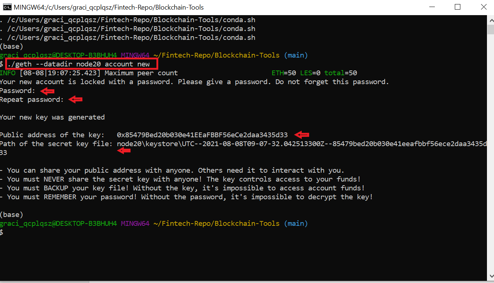

For each node:
 - Enter in a password of your selection.
 - Note down the public address and path of the secret keystore file for each node, as they will be required later. 

Notes:
 - The **--datadir** in the command provides the file path for the new accounts (eg. the created folders will be called node1 and node2).

&nbsp;

**4.2 To create blockchain genesis configurations**

Via Terminal, access the **Blockchain-Tools** folder (created above). Initiate puppeth with the following command:

   **./puppeth**

When prompted, enter in the network name (here, assignmtnet as example):

   **assignmtnet**

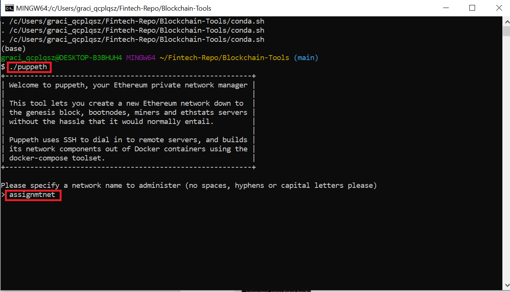

&nbsp;

When prompted, select 2. Configure new genesis, by entering:

   **2**

When prompted, select 1. Create new genesis from scratch, by entering:

   **1**

When prompted, select 2. Clique - Proof-of-Authority, by entering:

   **2**

When prompted, hit **enter** to select the default of 15 seconds per block.

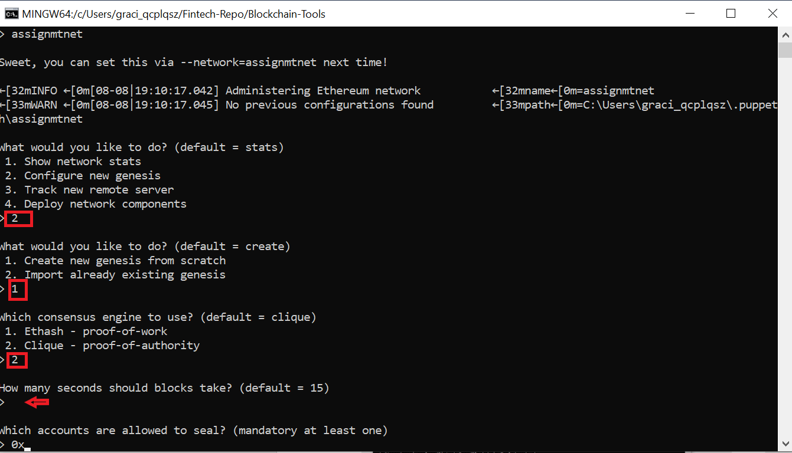

&nbsp;

When prompted for accounts allowed to seal, paste in the node accounts created earlier, one at a time.  This allows the accounts to seal on this testnet.  Note the beginning 0x of the account ID has already been prefilled for you.

When prompted, for pre-funded accounts, paste in the node accounts created earlier, one at a time.  As there are no block rewards in PoA networks, the accounts should be pre-funded.  Note the beginning 0x of the account ID has already been prefilled for you.

When asked whether the accounts should be pre-funded with 1 wei, enter '**yes**'.

When prompted, enter in your Chain ID (here, **888** has been used). Take note of your Chain ID as you will need it later:

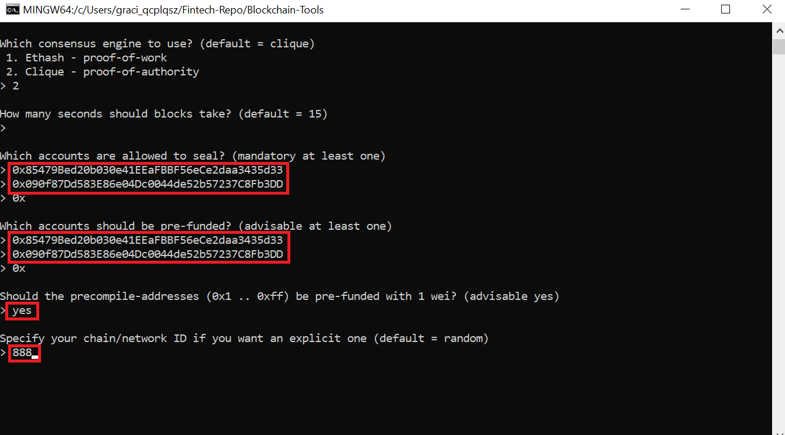

You should receive a confirmation "Configured new genesis block".

&nbsp;

**4.3 To export the blockchain genesis configurations**

Continuation from above.

When prompted, select 2. Manage existing genesis, by entering:

**2**

When prompted, select 2. Export genesis configurations, by entering:

**2**

When prompted, hit **enter** again to save configurations to the current folder **'Blockchain-Tools'** (default).

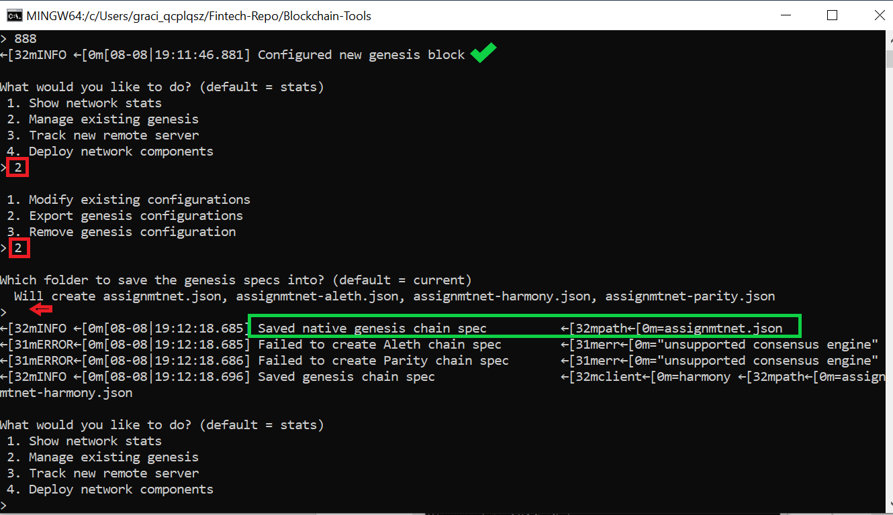

Note: 
 - Screenshots of the **puppeth configuration** are saved in the Screenshot folder, for your reference.
 - Four files will attempt to be created (but two files will be unsuccessful, please ignore). We only require the 'assignmtnet.json' file.

&nbsp;

**4.4 To initialise the new nodes with the testnet**

We will need to use the node numbers and testnet name created earlier, here node 1 & 2 and assignmtnet.

Open a new Terminal, access the Blockchain-Tools folder (created above).  To initialise node 1 with the testnet, enter the below:

   **./geth --datadir node1 init assignmtnet.json**

Then enter the command below to initialise node 2:

   **./geth --datadir node2 init assignmtnet.json**

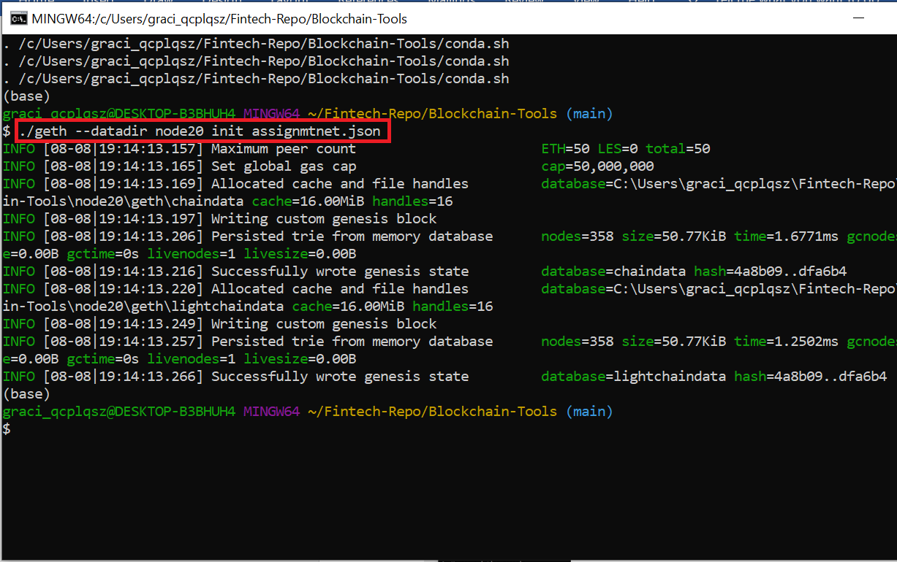

&nbsp;

**4.5 To run the new nodes with the testnet**

We will run node 1 (created above), as the mining node. 

Open a new Terminal in the **Blockchain-Tools** folder, and enter in the below (amend node number as requried, and copy / paste your Public Address for "SEALER_ONE_ADDRESS"):

   ***./geth --datadir node1 --unlock "SEALER_ONE_ADDRESS" --mine --rpc --allow-insecure-unlock**

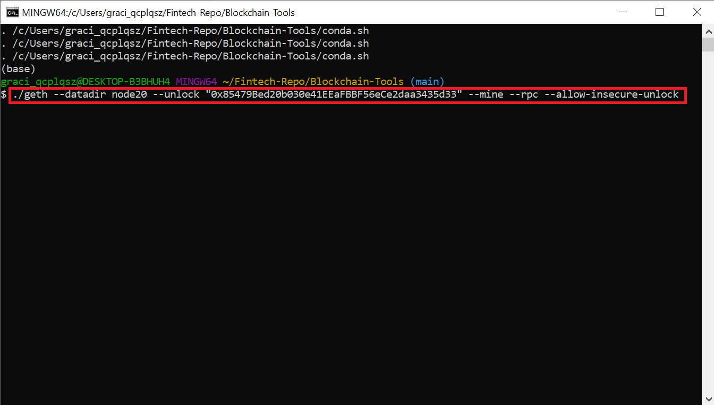

 - The **--mine** portion in the command specifies this will be a mining node.
 - The **--rpc** portion in the command specifies the use of json remote procedure call (RPC) protocol.

&nbsp;

The node will begin to run and will output a line starting with **self=enode.//XXXX**.  Copy the full text of this.

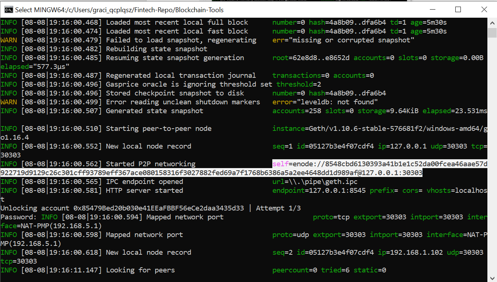

&nbsp;

We will run node 2 (created above), as the bootnode.

Open another new Terminal in the **Blockchain-Tools** folder, and enter in the below (amend node number as required, and copy / paste your Public Address in "SEALER_TWO_ADDRESS", and copy the enode from node 1 into the below command):

   **./geth --datadir node2 --unlock "SEALER_TWO_ADDRESS" --mine --port 30304 --bootnodes "enode://SEALER_ONE_ENODE_ADDRESS@127.0.0.1:30303" --ipcdisable --allow-insecure-unlock**

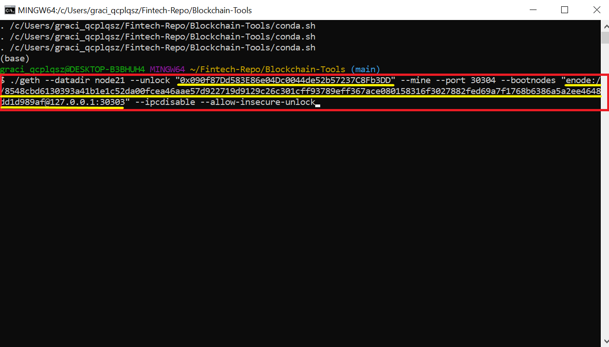

 - The **--bootnodes** portion in the command specifies this will be a bootstrap node that other nodes can use to find each other in the network or internet.

&nbsp;

You will be required to enter the password in both terminals for the two nodes.  If you are not prompted, try hitting **enter** in each of the terminals to trigger a prompt.

&nbsp;

The private blockchain should now be running and mining blocks.  You should be able to see mined blocks on Node 1 (our mining block).

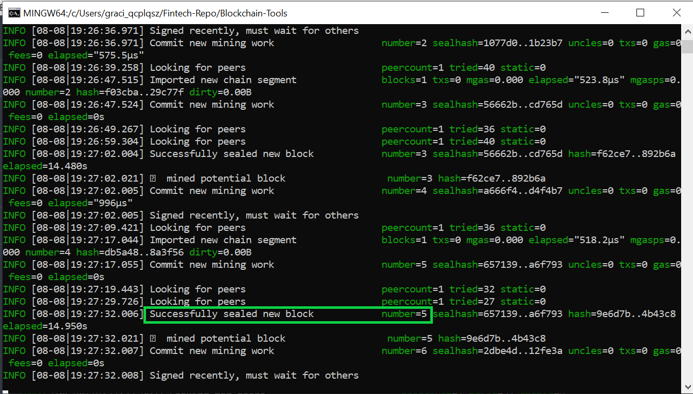

&nbsp;

**4.6 Connecting our network to MyCrypto Wallet**

Using MyCrypto Wallet, and the public / private keys obtained above, you will be able to view the balance in each node account, and also transfer funds between the nodes, or other test nodes.

Open the MyCrypto Wallet application, and click on the **Add Custom Node** (at bottom of left hand bar).

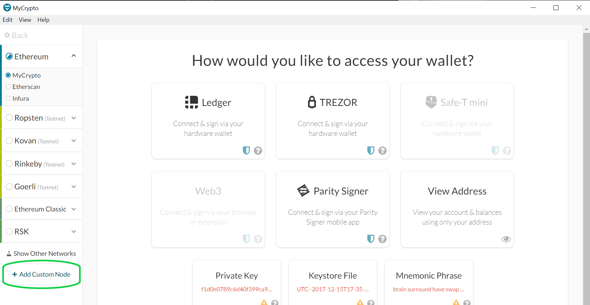

Set up our Custom Testnet onto MyCrypto Wallet by entering / selecting the below (the inputs need to match what we used in puppeth earlier):
 - Node Name: **assignmtnet**
 - Network: **Custom**
 - Network Name: **assignmtnet**
 - Currency: **ETH**
 - Chain ID: **888**
 - URL: **127.0.0.1.8545**

 Click **'Save & Use Custom Node'.**

 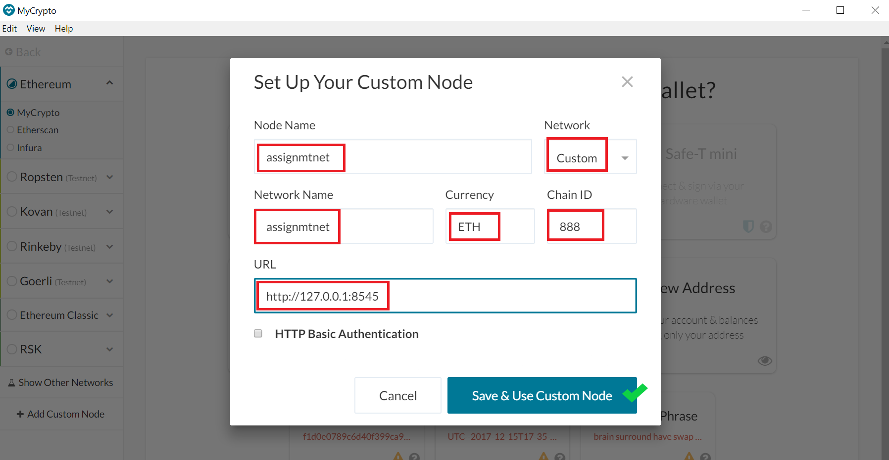

Check that you are now connected to the assignmtnet node.  On the bottom of the left bar, you should see a **green** radio button next to **'Connected to ETH Network'**.

&nbsp;

**4.7 Transfering Ether from one node to the other**

To transfer testnet ETH from one node account to another:
 - in MyCrypto Wallet, on the left bar, click on **'View & Send'**.
 - Then click on **'Keystore File'**.

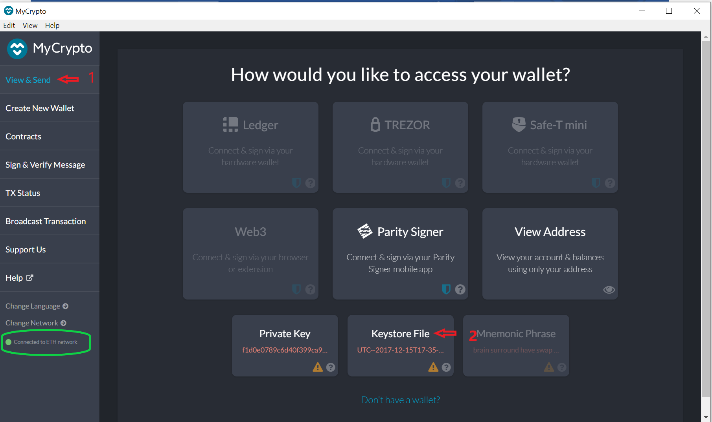

&nbsp;

Click **'Select Keystore Wallet'**, and navigate to the folder: **Blockchain-Tools / node1 / keystore**, and select the file named similar to **'UTC--datexxx--stringxxx'.**

Enter in your password (which we selected when we created the node in puppeth).

Click **'Unlock'.**

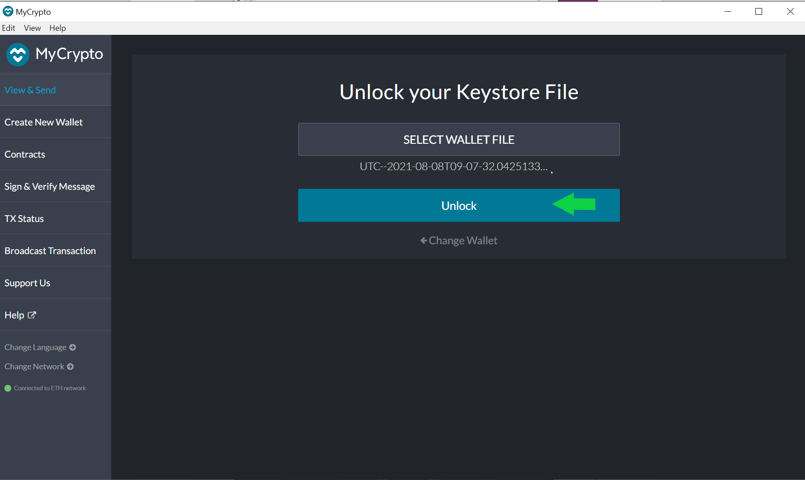!

&nbsp;

You are now in your Node 1 account, showing the Node's balance of ETH.  
Paste in the recipient address (eg for Node 2). 

Enter the amount to be transferred (ensure you have adequate balance), and enter **ETH**. 

Then click **'Send Transaction'**.

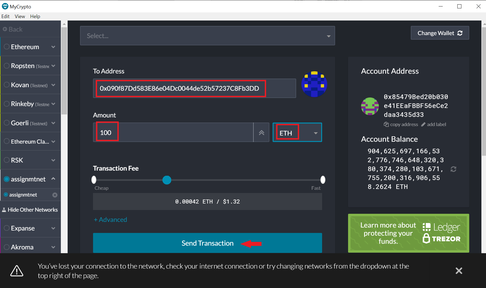!

You will be asked to confirm your confirmation.  Click **'Send'.**

&nbsp;

**4.8 Transaction confirmation data**

Once sent, you will be able to check the transaction status in MyCrypto Wallet.  To do this, in the Terminal running your node (here node 1 mining node), copy the transaction hash. 

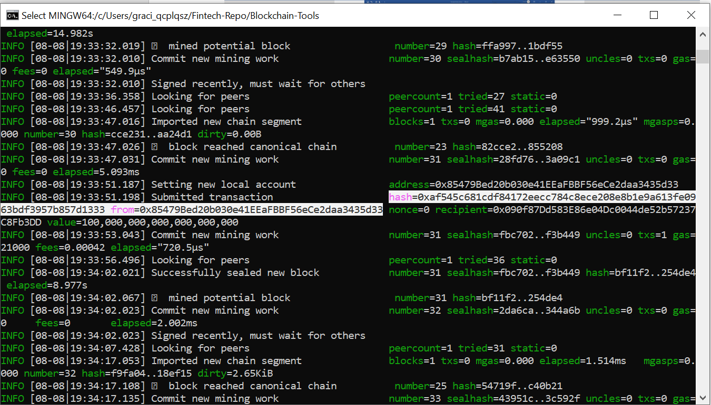!

&nbsp;

Then go to MyCrypto Wallet, and click **TX Status** on the left bar.  

Paste in the transaction hash, and click **'Check TX Status'**.

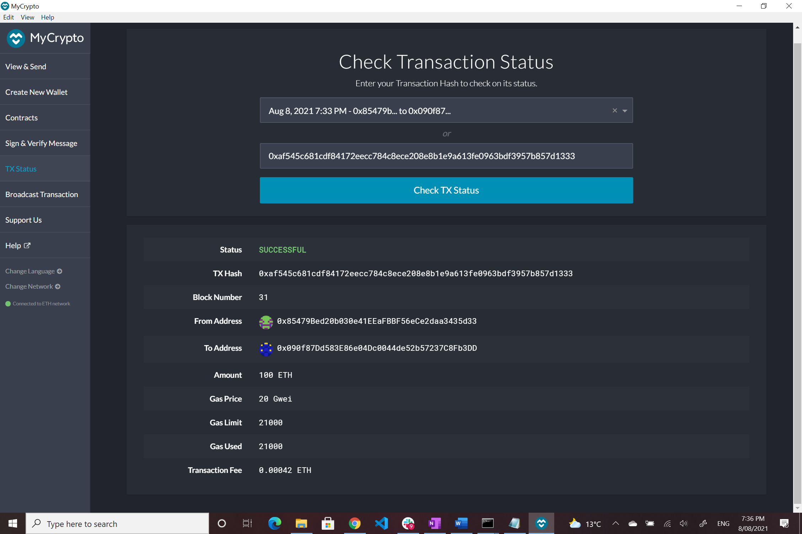!

&nbsp;

You will also be able to see the transction being submitted in your running node.  Here from node 1:

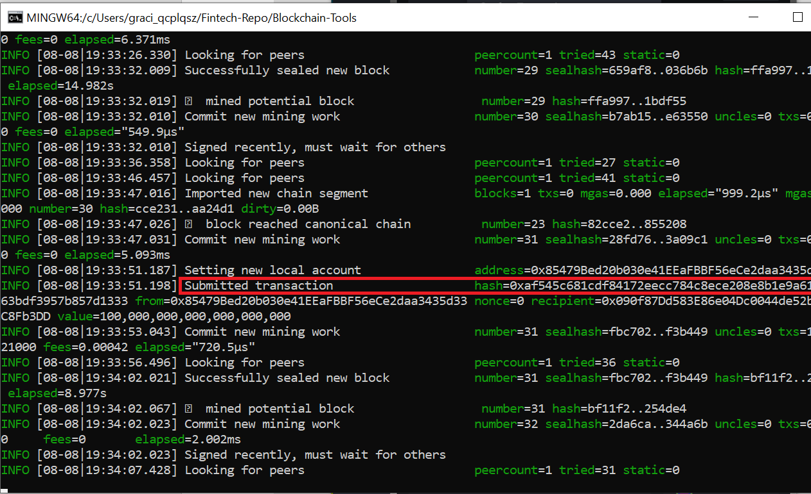!

Note:
 - The screenshot of the transaction metadata has been saved in the Screenshots folder.

&nbsp;

## Summary

This documentation has provided instructions on how to create a custom Ethereum Testnet, create and initialise new nodes on the blockchain, run the nodes as mining or bootnodes, and to transfer testnet Ether.

&nbsp;

--END DOCUMENT--

